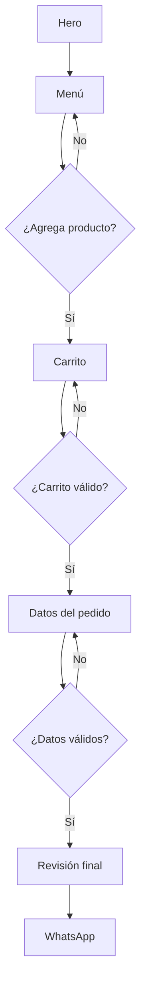

# 01 — User Flow

## Ruta principal

1. La persona llega al hero y entiende qué se vende.
2. Usa **Ver menú** o baja directamente al catálogo.
3. Filtra por categoría o explora especialidades.
4. Agrega un producto.
5. Recibe confirmación discreta y ve cantidad y subtotal actualizados.
6. Revisa y ajusta el carrito.
7. Elige entrega o recolección.
8. Captura únicamente los datos necesarios.
9. Revisa el resumen final.
10. Envía el pedido por WhatsApp.

## Decisiones del flujo

| Decisión | Comportamiento |
| --- | --- |
| Entrega | Solicita dirección y referencia; costo queda pendiente de regla real |
| Recolección | Oculta dirección; solicita sucursal solo cuando exista catálogo confirmado |
| Carrito vacío | No permite avanzar y orienta hacia el menú |
| Producto agotado | Se muestra pero no se puede agregar |
| Cambio de cantidad | Recalcula subtotal y total inmediatamente |
| Eliminación | Permite deshacer durante unos segundos |
| Pedido inválido | WhatsApp permanece deshabilitado y explica qué falta |
| Pedido válido | Muestra resumen final antes de abrir WhatsApp |

## Datos mínimos

- Nombre.
- Tipo de entrega: entrega o recolección.
- Dirección y referencia, solo si es entrega.
- Sucursal, solo si es recolección y existe información confirmada.
- Observaciones, opcionales.

Teléfono no se solicita por defecto: el contacto ya se establece mediante WhatsApp.

